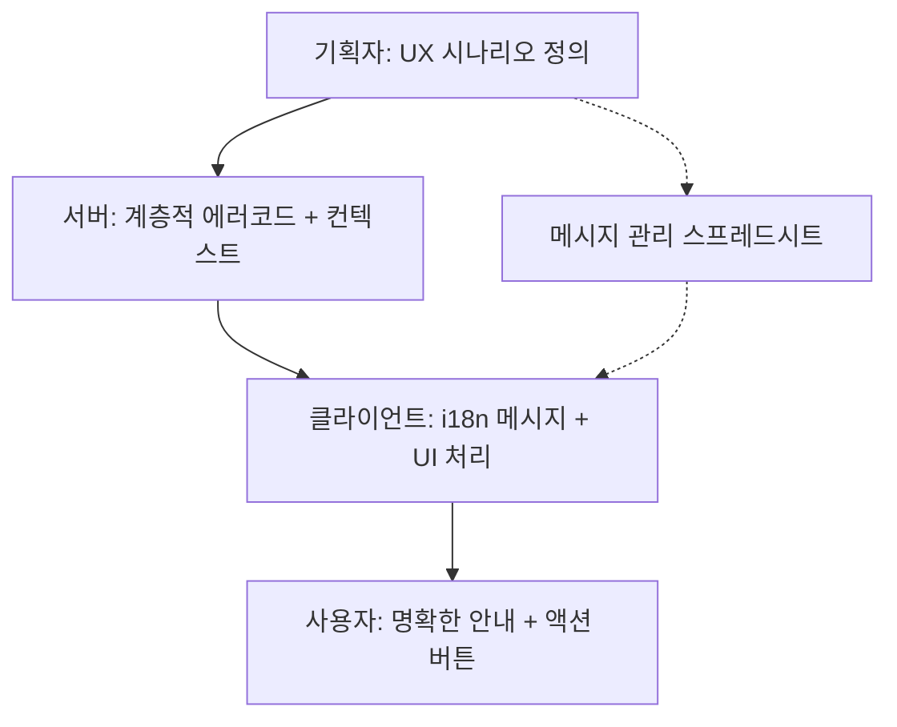
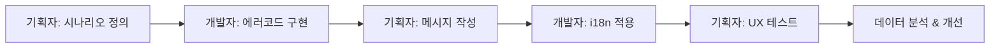

# 계층적 클라이언트 에러 처리 가이드

## 🎯 **역할 분담 체계**

### **기획자 → 서버 → 클라이언트 플로우**



### **책임 분할의 장점:**

- **기획자**: 사용자 경험과 메시지에 집중
- **서버**: 비즈니스 로직과 에러 감지에 집중
- **클라이언트**: UI/UX와 다국어 지원에 집중

## 개요

이 API는 **3계층 통일 에러 코드 시스템**과 **클라이언트 i18n** 방식을 사용합니다. 모든 에러가 `domain.action.reason` 구조로 통일되어 일관성을 보장하며, **메시지 번역은 클라이언트에서 처리**합니다.

## 계층적 에러 코드의 장점

### ✅ 그룹화 용이성

```javascript
// 발행 관련 모든 에러 처리
if (error.code.startsWith('meeting.publish.')) {
  handleMeetingPublishError();
}

// 스토리지 관련 모든 에러 처리
if (error.code.startsWith('storage.')) {
  handleStorageError();
}
```

### ✅ 확장성과 가독성

```javascript
// 에러 코드만 봐도 의미가 명확
'meeting.publish.isDraft'; // 미팅 발행 - 초안 상태 문제
'workspace.member.limitExceeded'; // 워크스페이스 멤버 - 한도 초과
'storage.upload.failed'; // 스토리지 업로드 실패
```

## API 에러 응답 구조

### 기본 응답 형태

```json
{
  "success": false,
  "error": {
    "code": "meeting.publish.isDraft",
    "context": {
      "currentStatus": "DRAFT",
      "requiredStatus": "COMPLETED"
    }
  },
  "timestamp": "2024-08-23T10:30:00Z"
}
```

### 응답 필드 설명

- **`code`**: 계층적 에러 코드 (domain.action.reason 구조, i18n 키로도 사용)
- **`context`**: 에러 관련 추가 정보 (i18n 템플릿 변수용)
- **`timestamp`**: 에러 발생 시점

## 에러 처리 전략

### HTTP 상태 코드만으로 충분한 경우

```typescript
// 단순한 케이스들
switch (response.status) {
  case 401:
    redirectToLogin();
    break;
  case 404:
    showNotFoundPage();
    break;
  case 500:
    showGenericError();
    break;
}
```

### 계층적 에러 코드 활용

```typescript
// 그룹별 에러 처리가 가능
if (response.status === 400) {
  // 계층적 구조를 활용한 그룹별 처리
  if (error.code.startsWith('meeting.publish.')) {
    showMeetingPublishGuide(error.code);
  } else if (error.code.startsWith('meeting.participant.')) {
    showParticipantLimitHelp();
  } else if (error.code.startsWith('storage.upload.')) {
    showFileUploadHelp();
  } else if (error.code.startsWith('validation.')) {
    showValidationErrors(error.context);
  }

  // 세부적인 처리도 여전히 가능
  switch (error.code) {
    case 'meeting.publish.isDraft':
      showMeetingCompletionGuide();
      break;
    case 'workspace.member.limitExceeded':
      showUpgradeModal();
      break;
  }
}
```

## 클라이언트 i18n 구현

### 1. React + react-i18next 예시

#### i18n 설정

```typescript
// src/i18n/resources/ko.json
{
  "errors": {
    // 미팅 도메인
    "meeting.publish.isDraft": "{{currentStatus}} 상태의 미팅은 발행할 수 없습니다. {{requiredStatus}} 상태가 되어야 합니다",
    "meeting.publish.alreadyPublished": "이미 발행된 미팅입니다",
    "meeting.participant.limitExceeded": "참여자는 최대 {{maxParticipants}}명까지 가능합니다",
    
    // Enum 값들의 다국어 처리
    "meeting.status.DRAFT": "초안",
    "meeting.status.IN_PROGRESS": "진행 중",
    "meeting.status.COMPLETED": "완료됨",
    "meeting.status.PAUSED": "일시정지",
    "meeting.status.PUBLISHED": "발행됨",

    // 워크스페이스 도메인
    "workspace.member.limitExceeded": "워크스페이스 멤버는 최대 {{maxMembers}}명까지 가능합니다",
    "workspace.access.memberRequired": "{{requiredRole}} 권한이 필요합니다",

    // 리소스 도메인 (3계층 통일)
    "resource.fetch.notFound": "{{resourceType}}을 찾을 수 없습니다",
    "resource.access.denied": "{{resourceType}}에 대한 {{requiredPermission}} 권한이 없습니다",

    // 스토리지 도메인
    "storage.upload.failed": "파일 업로드에 실패했습니다",
    "storage.file.notFound": "{{fileName}} 파일을 찾을 수 없습니다",

    // 검증 도메인 (3계층 통일)
    "validation.check.failed": "입력값을 확인해주세요",
    "validation.input.invalid": "{{field}} 형식이 올바르지 않습니다"
  },
  
  "meeting": {
    "status": {
      "DRAFT": "초안",
      "IN_PROGRESS": "진행 중",
      "COMPLETED": "완료됨",
      "PAUSED": "일시정지",
      "PUBLISHED": "발행됨"
    }
  },
  
  "workspace": {
    "role": {
      "OWNER": "소유자",
      "ADMIN": "관리자",
      "MEMBER": "멤버",
      "GUEST": "게스트"
    }
  }
}
}

// src/i18n/resources/en.json
{
  "errors": {
    // Meeting domain
    "meeting.publish.isDraft": "Cannot publish meeting in {{currentStatus}} status. Must be {{requiredStatus}}",
    "meeting.publish.alreadyPublished": "Meeting is already published",
    "meeting.participant.limitExceeded": "Maximum {{maxParticipants}} participants allowed",

    // Workspace domain
    "workspace.member.limitExceeded": "Maximum {{maxMembers}} members allowed",
    "workspace.access.memberRequired": "{{requiredRole}} permission required",

    // Resource domain (3-layer unified)
    "resource.fetch.notFound": "{{resourceType}} not found",
    "resource.access.denied": "{{requiredPermission}} permission required for {{resourceType}}",

    // Storage domain
    "storage.upload.failed": "File upload failed",
    "storage.file.notFound": "File {{fileName}} not found",

    // Validation domain (3-layer unified)
    "validation.check.failed": "Please check your input",
    "validation.input.invalid": "Invalid format for {{field}}"
  },
  
  "meeting": {
    "status": {
      "DRAFT": "Draft",
      "IN_PROGRESS": "In Progress",
      "COMPLETED": "Completed",
      "PAUSED": "Paused",
      "PUBLISHED": "Published"
    }
  },
  
  "workspace": {
    "role": {
      "OWNER": "Owner",
      "ADMIN": "Admin",
      "MEMBER": "Member",
      "GUEST": "Guest"
    }
  }
}
}
```

#### 에러 처리 컴포넌트

```typescript
import { useTranslation } from 'react-i18next';

// 타입 안전성을 위한 3계층 통일 에러 코드 정의
type HierarchicalErrorCode =
  | 'auth.validate.failed'        // 3계층 통일
  | 'auth.authorize.denied'       // 3계층 통일
  | 'meeting.publish.isDraft'
  | 'meeting.publish.alreadyPublished'
  | 'meeting.participant.limitExceeded'
  | 'workspace.member.limitExceeded'
  | 'resource.fetch.notFound'     // 3계층 통일
  | 'storage.upload.failed'
  | 'validation.check.failed'     // 3계층 통일
  // ... 기타 에러 코드들

interface ApiError {
  code: HierarchicalErrorCode;
  context?: Record<string, any>;
}

const ErrorHandler: React.FC<{ error: ApiError }> = ({ error }) => {
  const { t } = useTranslation();

  const getMessage = () => {
    // 컨텍스트 변수 중 enum 값들을 다국어로 변환
    const localizedContext = getLocalizedContext(error.context || {}, error.code, t);
    return t(`errors.${error.code}`, localizedContext);
  };
  
  // 컨텍스트 변수 다국어 처리 헬퍼 함수
  const getLocalizedContext = (context: Record<string, any>, errorCode: string, t: any) => {
    const localizedContext = { ...context };
    const domain = errorCode.split('.')[0]; // 'meeting', 'workspace' 등
    
    // 상태 관련 필드들을 자동으로 번역
    Object.entries(context).forEach(([key, value]) => {
      if (typeof value === 'string') {
        // 상태값 패턴 감지 및 번역
        if (key.toLowerCase().includes('status') && /^[A-Z_]+$/.test(value)) {
          const translated = t(`${domain}.status.${value}`, { defaultValue: value });
          localizedContext[key] = translated;
        }
        // 역할 관련 필드 번역
        else if (key.toLowerCase().includes('role') && /^[A-Z_]+$/.test(value)) {
          const translated = t(`${domain}.role.${value}`, { defaultValue: value });
          localizedContext[key] = translated;
        }
        // 권한 관련 필드 번역
        else if (key.toLowerCase().includes('permission') && /^[A-Z_]+$/.test(value)) {
          const translated = t(`${domain}.permission.${value}`, { defaultValue: value });
          localizedContext[key] = translated;
        }
      }
    });
    
    return localizedContext;
  };

  const getActionButton = () => {
    // 계층적 구조를 활용한 그룹별 처리
    if (error.code.startsWith('meeting.publish.')) {
      return <Button onClick={showMeetingGuide}>미팅 완료 가이드</Button>;
    }

    if (error.code.startsWith('meeting.participant.')) {
      return <Button onClick={showUpgradeModal}>요금제 업그레이드</Button>;
    }

    if (error.code.startsWith('auth.')) {
      return <Button onClick={redirectToLogin}>로그인</Button>;
    }

    if (error.code.startsWith('storage.upload.')) {
      return <Button onClick={showFileUploadHelp}>업로드 도움말</Button>;
    }

    // 세부적인 처리
    switch (error.code) {
      case 'workspace.member.limitExceeded':
        return <Button onClick={showUpgradeModal}>워크스페이스 업그레이드</Button>;
      case 'validation.failed':
        return <Button onClick={focusFirstInvalidField}>필드 확인</Button>;
      default:
        return null;
    }
  };

  const getErrorIcon = () => {
    // 도메인별 아이콘
    if (error.code.startsWith('meeting.')) return '📅';
    if (error.code.startsWith('workspace.')) return '🏢';
    if (error.code.startsWith('storage.')) return '📁';
    if (error.code.startsWith('auth.')) return '🔒';
    return '⚠️';
  };

  return (
    <div className="error-message">
      <span className="error-icon">{getErrorIcon()}</span>
      <p>{getMessage()}</p>
      {getActionButton()}
    </div>
  );
};
```

#### API 클라이언트 통합

```typescript
// src/api/client.ts
import axios from 'axios';
import { toast } from 'react-hot-toast';
import i18n from '../i18n';

const apiClient = axios.create({
  baseURL: '/api',
});

apiClient.interceptors.response.use(
  (response) => response,
  (error) => {
    const apiError = error.response?.data?.error;

    if (apiError?.code) {
      const message = i18n.t(`errors.${apiError.code}`, apiError.context || {});
      toast.error(message);

      // 계층적 구조를 활용한 에러 처리
      handleHierarchicalErrors(apiError);
    }

    return Promise.reject(error);
  }
);

function handleHierarchicalErrors(error: ApiError) {
  // 그룹별 에러 처리 (우선순위 높음)
  if (error.code.startsWith('auth.')) {
    localStorage.removeItem('token');
    window.location.href = '/login';
    return;
  }

  if (error.code.startsWith('meeting.publish.')) {
    showMeetingPublishGuide(error.code);
    return;
  }

  if (error.code.startsWith('storage.upload.')) {
    showFileUploadHelp();
    return;
  }

  // 세부적인 에러 처리
  switch (error.code) {
    case 'workspace.member.limitExceeded':
      showUpgradeModal('workspace');
      break;
    case 'meeting.participant.limitExceeded':
      showUpgradeModal('meeting');
      break;
    case 'validation.failed':
      // 검증 에러는 폼에서 개별 처리
      break;
  }
}

// 에러 분석을 위한 헬퍼 함수들
const ErrorAnalytics = {
  track(error: ApiError) {
    const domain = error.code.split('.')[0];
    const action = error.code.split('.')[1];

    analytics.track('API Error', {
      errorCode: error.code,
      domain,
      action,
      context: error.context,
      timestamp: new Date().toISOString(),
    });
  },

  // 도메인별 에러 통계
  getDomainErrorStats() {
    // 에러 로그에서 도메인별 통계 추출
    return {
      meeting: { count: 45, mostCommon: 'meeting.publish.isDraft' },
      workspace: { count: 23, mostCommon: 'workspace.member.limitExceeded' },
      storage: { count: 12, mostCommon: 'storage.upload.failed' },
    };
  },
};
```

### 2. Vue.js + Vue I18n 예시

#### i18n 설정 (계층적 구조 활용)

```typescript
// src/i18n/index.ts
import { createI18n } from 'vue-i18n';
import ko from './locales/ko.json';
import en from './locales/en.json';

const i18n = createI18n({
  locale: 'ko',
  messages: { ko, en },
});

export default i18n;
```

#### 계층적 에러 핸들러

```typescript
// src/composables/useErrorHandler.ts
import { useI18n } from 'vue-i18n';
import { ElMessage } from 'element-plus';
import { useRouter } from 'vue-router';

type HierarchicalErrorCode =
  | 'auth.validate.failed' // 3계층 통일
  | 'meeting.publish.isDraft'
  | 'workspace.member.limitExceeded';
// ... 기타 코드들

interface ApiError {
  code: HierarchicalErrorCode;
  context?: Record<string, any>;
}

export function useErrorHandler() {
  const { t } = useI18n();
  const router = useRouter();

  const handleError = (error: ApiError) => {
    const message = t(`errors.${error.code}`, error.context || {});
    ElMessage.error(message);

    // 계층적 구조 활용한 그룹별 처리
    if (error.code.startsWith('auth.')) {
      router.push('/login');
      return;
    }

    if (error.code.startsWith('meeting.publish.')) {
      showMeetingPublishGuide(error.code);
      return;
    }

    if (error.code.startsWith('workspace.member.')) {
      showUpgradeModal('workspace');
      return;
    }

    // 세부 처리
    switch (error.code) {
      case 'storage.uploadFailed':
        showFileUploadHelp();
        break;
    }
  };

  return { handleError };
}
```

### 3. 바닐라 JavaScript 예시 (계층적 구조)

```typescript
// src/utils/hierarchicalErrorHandler.js
class HierarchicalErrorHandler {
  constructor(locale = 'ko') {
    this.locale = locale;
    this.messages = {
      ko: {
        // 인증 도메인 (3계층 통일)
        'auth.validate.failed': '로그인이 필요합니다',
        'auth.authorize.denied': '권한이 없습니다',

        // 미팅 도메인 - 발행 관련
        'meeting.publish.isDraft':
          '{{currentStatus}} 상태의 미팅은 발행할 수 없습니다',
        'meeting.publish.alreadyPublished': '이미 발행된 미팅입니다',

        // 워크스페이스 도메인
        'workspace.member.limitExceeded':
          '워크스페이스 멤버는 최대 {{maxMembers}}명까지 가능합니다',

        // 리소스 도메인 (3계층 통일)
        'resource.fetch.notFound': '{{resourceType}}을(를) 찾을 수 없습니다',

        // 검증 도메인 (3계층 통일)
        'validation.check.failed': '입력값을 확인해주세요',
      },
      en: {
        // Auth domain (3-layer unified)
        'auth.validate.failed': 'Login required',
        'auth.authorize.denied': 'Access denied',

        // Meeting domain - publish actions
        'meeting.publish.isDraft':
          'Cannot publish meeting in {{currentStatus}} status',
        'meeting.publish.alreadyPublished': 'Meeting is already published',

        // Workspace domain
        'workspace.member.limitExceeded':
          'Maximum {{maxMembers}} members allowed',

        // Resource domain (3-layer unified)
        'resource.fetch.notFound': '{{resourceType}} not found',

        // Validation domain (3-layer unified)
        'validation.check.failed': 'Please check your input',
      },
    };
  }

  getMessage(code, context = {}) {
    let template = this.messages[this.locale][code] || code;

    // 템플릿 변수 치환
    Object.keys(context).forEach((key) => {
      template = template.replace(new RegExp(`{{${key}}}`, 'g'), context[key]);
    });

    return template;
  }

  handle(error) {
    const message = this.getMessage(error.code, error.context);
    this.showError(message);
    this.handleSpecialCases(error);
  }

  showError(message) {
    // 토스트나 모달로 표시
    console.error(message);
  }

  // 계층적 구조를 활용한 에러 처리
  handleSpecialCases(error) {
    // 그룹별 처리 (우선순위 높음)
    if (error.code.startsWith('auth.')) {
      this.handleAuthErrors(error);
      return;
    }

    if (error.code.startsWith('meeting.publish.')) {
      this.showMeetingPublishGuide(error.code);
      return;
    }

    if (error.code.startsWith('workspace.member.')) {
      this.showUpgradeModal('workspace');
      return;
    }

    // 세부 처리
    switch (error.code) {
      case 'storage.uploadFailed':
        this.showFileUploadHelp();
        break;
      case 'validation.failed':
        this.highlightInvalidFields();
        break;
    }
  }

  handleAuthErrors(error) {
    localStorage.removeItem('token');
    window.location.href = '/login';
  }

  showMeetingPublishGuide(errorCode) {
    // 미팅 발행 가이드 모달 표시
    console.log(`Showing meeting publish guide for: ${errorCode}`);
  }

  showUpgradeModal(type) {
    // 업그레이드 모달 표시
    console.log(`Showing upgrade modal for: ${type}`);
  }

  showFileUploadHelp() {
    // 파일 업로드 도움말 표시
    console.log('Showing file upload help');
  }

  highlightInvalidFields() {
    // 잘못된 필드 하이라이트
    console.log('Highlighting invalid form fields');
  }
}
```

### 컨텍스트 변수의 다국어 처리

컨텍스트 변수 자체도 다국어 처리가 가능합니다:

```typescript
// 서버에서는 원본 enum 값 전송
throw new AppError('meeting.publish.isDraft', {
  currentStatus: 'DRAFT',
  requiredStatus: 'COMPLETED'
});

// API 응답
{
  "error": {
    "code": "meeting.publish.isDraft",
    "context": {
      "currentStatus": "DRAFT",
      "requiredStatus": "COMPLETED"
    }
  }
}

// 클라이언트에서 자동으로 번역 처리
const getSmartErrorMessage = (error: ApiError) => {
  const { t } = useTranslation();
  
  // 컨텍스트의 enum 값들을 자동으로 번역
  const smartContext = Object.entries(error.context || {}).reduce((acc, [key, value]) => {
    if (typeof value === 'string' && /^[A-Z_]+$/.test(value)) {
      const domain = error.code.split('.')[0];
      
      // 필드명으로 카테고리 추정
      let category = 'status'; // 기본값
      if (key.toLowerCase().includes('role')) category = 'role';
      if (key.toLowerCase().includes('permission')) category = 'permission';
      if (key.toLowerCase().includes('type')) category = 'type';
      
      // 번역 시도 (실패시 원본 사용)
      const translationKey = `${domain}.${category}.${value}`;
      const translated = t(translationKey);
      acc[key] = translated !== translationKey ? translated : value;
    } else {
      acc[key] = value;
    }
    return acc;
  }, {} as Record<string, any>);
  
  return t(`errors.${error.code}`, smartContext);
};

// 사용 예시
const message = getSmartErrorMessage({
  code: 'meeting.publish.isDraft',
  context: { currentStatus: 'DRAFT', requiredStatus: 'COMPLETED' }
});
// 결과: "초안 상태의 미팅은 발행할 수 없습니다. 완료됨 상태가 되어야 합니다"
```

### 타입 안전한 컨텍스트 번역

```typescript
// Enum 타입 정의
enum MeetingStatus {
  DRAFT = 'DRAFT',
  IN_PROGRESS = 'IN_PROGRESS',
  COMPLETED = 'COMPLETED',
  PAUSED = 'PAUSED',
  PUBLISHED = 'PUBLISHED'
}

enum WorkspaceRole {
  OWNER = 'OWNER',
  ADMIN = 'ADMIN',
  MEMBER = 'MEMBER',
  GUEST = 'GUEST'
}

// 번역 헬퍼 함수들
const translateMeetingStatus = (status: MeetingStatus, t: any) => {
  return t(`meeting.status.${status}`, { defaultValue: status });
};

const translateWorkspaceRole = (role: WorkspaceRole, t: any) => {
  return t(`workspace.role.${role}`, { defaultValue: role });
};

// 에러 컨텍스트 번역기
const translateErrorContext = (error: ApiError, t: any) => {
  const { context = {} } = error;
  const domain = error.code.split('.')[0];
  
  const translatedContext = { ...context };
  
  // 미팅 도메인
  if (domain === 'meeting') {
    if (context.currentStatus && Object.values(MeetingStatus).includes(context.currentStatus)) {
      translatedContext.currentStatus = translateMeetingStatus(context.currentStatus, t);
    }
    if (context.requiredStatus && Object.values(MeetingStatus).includes(context.requiredStatus)) {
      translatedContext.requiredStatus = translateMeetingStatus(context.requiredStatus, t);
    }
  }
  
  // 워크스페이스 도메인
  if (domain === 'workspace') {
    if (context.currentRole && Object.values(WorkspaceRole).includes(context.currentRole)) {
      translatedContext.currentRole = translateWorkspaceRole(context.currentRole, t);
    }
    if (context.requiredRole && Object.values(WorkspaceRole).includes(context.requiredRole)) {
      translatedContext.requiredRole = translateWorkspaceRole(context.requiredRole, t);
    }
  }
  
  return translatedContext;
};

// 최종 에러 메시지 생성
const getErrorMessage = (error: ApiError) => {
  const { t } = useTranslation();
  const translatedContext = translateErrorContext(error, t);
  return t(`errors.${error.code}`, translatedContext);
};
```

### 고급 컨텍스트 처리

```typescript
// 복합적인 컨텍스트 처리
const AdvancedErrorHandler: React.FC<{ error: ApiError }> = ({ error }) => {
  const { t, i18n } = useTranslation();
  
  const getEnhancedMessage = () => {
    let context = { ...error.context };
    
    // 1. 기본 enum 번역
    context = translateEnumValues(context, error.code, t);
    
    // 2. 숫자 포맷팅 (locale에 따라)
    context = formatNumbers(context, i18n.language);
    
    // 3. 날짜 포맷팅
    context = formatDates(context, i18n.language);
    
    return t(`errors.${error.code}`, context);
  };
  
  const translateEnumValues = (ctx: any, errorCode: string, t: any) => {
    const domain = errorCode.split('.')[0];
    const translated = { ...ctx };
    
    Object.entries(ctx).forEach(([key, value]) => {
      if (typeof value === 'string' && /^[A-Z_]+$/.test(value)) {
        // 다양한 카테고리 시도
        const categories = ['status', 'role', 'permission', 'type', 'priority'];
        for (const category of categories) {
          const translationKey = `${domain}.${category}.${value}`;
          const result = t(translationKey);
          if (result !== translationKey) {
            translated[key] = result;
            break;
          }
        }
      }
    });
    
    return translated;
  };
  
  const formatNumbers = (ctx: any, locale: string) => {
    const formatted = { ...ctx };
    Object.entries(ctx).forEach(([key, value]) => {
      if (typeof value === 'number') {
        formatted[key] = new Intl.NumberFormat(locale).format(value);
      }
    });
    return formatted;
  };
  
  const formatDates = (ctx: any, locale: string) => {
    const formatted = { ...ctx };
    Object.entries(ctx).forEach(([key, value]) => {
      if (key.toLowerCase().includes('date') || key.toLowerCase().includes('time')) {
        if (typeof value === 'string' && !isNaN(Date.parse(value))) {
          formatted[key] = new Intl.DateTimeFormat(locale).format(new Date(value));
        }
      }
    });
    return formatted;
  };
  
  return (
    <div className="error-message">
      <p>{getEnhancedMessage()}</p>
    </div>
  );
};
```

## 📋 **통합 메시지 관리**

### **기획자-개발자 협업을 위한 스프레드시트**

| 구분       | 에러코드                         | 한국어 메시지                                      | 영어 메시지                                        | 컨텍스트                      | 클라이언트 액션      | 기획 노트         | 개발 상태  |
| ---------- | -------------------------------- | -------------------------------------------------- | -------------------------------------------------- | ----------------------------- | -------------------- | ----------------- | ---------- |
| 서버       | `meeting.publish.isDraft`        | {{currentStatus}} 상태의 미팅은 발행할 수 없습니다 | Cannot publish meeting in {{currentStatus}} status | currentStatus, requiredStatus | [미팅 완료하기] 버튼 | 사용자 전환율 87% | ✅ 완료    |
| 서버       | `workspace.member.limitExceeded` | 멤버는 최대 {{maxMembers}}명까지 가능합니다        | Maximum {{maxMembers}} members allowed             | maxMembers, currentCount      | [업그레이드] 모달    | 유료 전환 기회    | 🚧 개발 중 |
| 클라이언트 | `form.validation.email`          | 올바른 이메일을 입력해주세요                       | Please enter a valid email                         | -                             | 필드 하이라이트      | 실시간 검증       | ✅ 완료    |

### **메시지 라이프사이클**



## 계층적 에러 코드 목록

### 인증/권한 도메인 (auth._._) - 3계층 통일

| 코드                    | HTTP | 설명           | 컨텍스트 | 권장 처리                  |
| ----------------------- | ---- | -------------- | -------- | -------------------------- |
| `auth.validate.failed`  | 401  | 인증 검증 실패 | 없음     | 로그인 페이지로 리다이렉트 |
| `auth.validate.expired` | 401  | 토큰 검증 만료 | 없음     | 토큰 갱신 또는 재로그인    |
| `auth.authorize.denied` | 403  | 권한 승인 거부 | 없음     | 권한 없음 안내             |

### 미팅 도메인 (meeting.\*)

#### 발행 관련 (meeting.publish.\*)

| 코드                               | HTTP | 설명                     | 컨텍스트                          |
| ---------------------------------- | ---- | ------------------------ | --------------------------------- |
| `meeting.publish.isDraft`          | 400  | 초안 상태 미팅 발행 불가 | `currentStatus`, `requiredStatus` |
| `meeting.publish.alreadyPublished` | 400  | 이미 발행된 미팅         | 없음                              |

#### 참여자 관련 (meeting.participant.\*)

| 코드                                | HTTP | 설명                | 컨텍스트                          |
| ----------------------------------- | ---- | ------------------- | --------------------------------- |
| `meeting.participant.limitExceeded` | 400  | 참여자 수 제한 초과 | `maxParticipants`, `currentCount` |

#### 상태 관련 (meeting.status.\*)

| 코드                               | HTTP | 설명             | 컨텍스트                           |
| ---------------------------------- | ---- | ---------------- | ---------------------------------- |
| `meeting.status.invalidTransition` | 400  | 잘못된 상태 전환 | `from`, `to`, `allowedTransitions` |

#### 삭제 관련 (meeting.delete.\*)

| 코드                        | HTTP | 설명                     | 컨텍스트        |
| --------------------------- | ---- | ------------------------ | --------------- |
| `meeting.delete.inProgress` | 400  | 진행 중 상태로 삭제 불가 | `currentStatus` |

### 워크스페이스 도메인 (workspace.\*)

#### 멤버 관련 (workspace.member.\*)

| 코드                             | HTTP | 설명                           | 컨텍스트                     |
| -------------------------------- | ---- | ------------------------------ | ---------------------------- |
| `workspace.member.limitExceeded` | 429  | 워크스페이스 멤버 수 제한 초과 | `maxMembers`, `currentCount` |

#### 접근 관련 (workspace.access.\*)

| 코드                              | HTTP | 설명                   | 컨텍스트                      |
| --------------------------------- | ---- | ---------------------- | ----------------------------- |
| `workspace.access.memberRequired` | 403  | 멤버 권한 필요         | `requiredRole`, `currentRole` |
| `workspace.access.denied`         | 403  | 워크스페이스 접근 거부 | `requiredPermission`          |

### 스토리지 도메인 (storage.\*)

#### 업로드 관련 (storage.upload.\*)

| 코드                    | HTTP | 설명             | 컨텍스트                        |
| ----------------------- | ---- | ---------------- | ------------------------------- |
| `storage.upload.failed` | 502  | 파일 업로드 실패 | `maxFileSize`, `allowedFormats` |

#### 파일 관련 (storage.file.\*)

| 코드                    | HTTP | 설명                | 컨텍스트   |
| ----------------------- | ---- | ------------------- | ---------- |
| `storage.file.notFound` | 404  | 파일을 찾을 수 없음 | `fileName` |

#### 기타 스토리지 작업

| 코드                          | HTTP | 설명                    | 컨텍스트 |
| ----------------------------- | ---- | ----------------------- | -------- |
| `storage.delete.failed`       | 502  | 파일 삭제 실패          | 없음     |
| `storage.presignedUrl.failed` | 502  | 사전 서명 URL 생성 실패 | 없음     |

### 검증 도메인 (validation._._) - 3계층 통일

| 코드                       | HTTP | 설명            | 컨텍스트                                |
| -------------------------- | ---- | --------------- | --------------------------------------- |
| `validation.check.failed`  | 400  | 검증 체크 실패  | `fields: { fieldName: ['ERROR_TYPE'] }` |
| `validation.input.invalid` | 400  | 잘못된 입력값   | `field`, `expectedFormat`               |
| `validation.param.invalid` | 400  | 잘못된 매개변수 | `paramName`, `allowedValues`            |

### 리소스 도메인 (resource._._) - 3계층 통일

| 코드                       | HTTP | 설명             | 컨텍스트                             |
| -------------------------- | ---- | ---------------- | ------------------------------------ |
| `resource.fetch.notFound`  | 404  | 리소스 조회 실패 | `resourceType`                       |
| `resource.fetch.duplicate` | 409  | 리소스 중복 발견 | `resourceType`, `conflictField`      |
| `resource.access.denied`   | 403  | 리소스 접근 거부 | `resourceType`, `requiredPermission` |

## 모범 사례

### 1. 계층적 에러 코드 기반 조건부 렌더링

```typescript
const ErrorDisplay: React.FC<{ error: ApiError }> = ({ error }) => {
  // 그룹별 에러 처리 (우선순위 높음)
  if (error.code.startsWith('meeting.publish.')) {
    return (
      <div className="meeting-publish-error">
        <h3>미팅 발행 문제</h3>
        <p>{getMessage(error.code, error.context)}</p>
        <Button onClick={showMeetingGuide}>미팅 완료 가이드</Button>
      </div>
    );
  }

  if (error.code.startsWith('workspace.member.')) {
    return (
      <div className="workspace-limit-error">
        <h3>워크스페이스 제한</h3>
        <p>{getMessage(error.code, error.context)}</p>
        <Button onClick={showUpgradeModal}>요금제 업그레이드</Button>
        <Button onClick={showUsageDetails}>사용량 확인</Button>
      </div>
    );
  }

  if (error.code.startsWith('storage.upload.')) {
    return (
      <div className="storage-error">
        <h3>파일 업로드 실패</h3>
        <p>{getMessage(error.code, error.context)}</p>
        <Button onClick={showFileUploadHelp}>업로드 도움말</Button>
        <Button onClick={retryUpload}>다시 시도</Button>
      </div>
    );
  }

  // 세부적인 처리
  switch (error.code) {
    case 'auth.validate.failed':
      return (
        <div>
          <p>로그인이 필요합니다.</p>
          <Button onClick={goToLogin}>로그인하기</Button>
        </div>
      );

    default:
      return <p>{getMessage(error.code, error.context)}</p>;
  }
};
```

### 2. 타입 안전성 확보

```typescript
// 3계층 통일 에러 코드 타입 정의 (서버와 동기화)
type HierarchicalErrorCode =
  | 'auth.validate.failed' // 3계층 통일
  | 'meeting.publish.isDraft'
  | 'workspace.member.limitExceeded'
  | 'storage.upload.failed'
  | 'validation.check.failed'; // 3계층 통일
// ... 기타 코드들

// 도메인별 타입 정의
type MeetingError = Extract<HierarchicalErrorCode, `meeting.${string}`>;
type WorkspaceError = Extract<HierarchicalErrorCode, `workspace.${string}`>;
type StorageError = Extract<HierarchicalErrorCode, `storage.${string}`>;

interface ApiError {
  code: HierarchicalErrorCode;
  context?: Record<string, any>;
}

// 타입 가드 함수들
function isApiError(error: any): error is ApiError {
  return error && typeof error.code === 'string';
}

function isMeetingError(
  error: ApiError
): error is ApiError & { code: MeetingError } {
  return error.code.startsWith('meeting.');
}

function isWorkspaceError(
  error: ApiError
): error is ApiError & { code: WorkspaceError } {
  return error.code.startsWith('workspace.');
}
```

### 3. 에러 분석 및 통계

```typescript
// 계층적 구조를 활용한 에러 분석
class ErrorAnalytics {
  static analyzeDomainErrors(errors: ApiError[]) {
    const domainStats = errors.reduce(
      (acc, error) => {
        const domain = error.code.split('.')[0];
        acc[domain] = (acc[domain] || 0) + 1;
        return acc;
      },
      {} as Record<string, number>
    );

    return domainStats;
    // 결과: { meeting: 45, workspace: 23, storage: 12, auth: 8 }
  }

  static analyzeActionErrors(errors: ApiError[], targetDomain: string) {
    return errors
      .filter((e) => e.code.startsWith(`${targetDomain}.`))
      .reduce(
        (acc, error) => {
          const action = error.code.split('.')[1];
          acc[action] = (acc[action] || 0) + 1;
          return acc;
        },
        {} as Record<string, number>
      );
    // meeting 도메인 예시: { publish: 23, delete: 12, participant: 10 }
  }

  static getTopErrorsByGroup(errors: ApiError[], limit = 5) {
    const errorCounts = errors.reduce(
      (acc, error) => {
        acc[error.code] = (acc[error.code] || 0) + 1;
        return acc;
      },
      {} as Record<string, number>
    );

    return Object.entries(errorCounts)
      .sort(([, a], [, b]) => b - a)
      .slice(0, limit)
      .map(([code, count]) => ({ code, count }));
  }
}
```

### 4. 계층적 에러 로깅 및 모니터링

```typescript
const handleHierarchicalError = (error: ApiError) => {
  // 사용자에게 표시
  const message = getMessage(error.code, error.context);
  showToast(message);

  // 계층적 구조를 활용한 모니터링
  const [domain, action, reason] = error.code.split('.');

  analytics.track('API Error', {
    errorCode: error.code,
    domain,
    action,
    reason,
    context: error.context,
    userAgent: navigator.userAgent,
    timestamp: new Date().toISOString(),

    // 계층적 구조의 이점 활용
    errorGroup: `${domain}.${action || '*'}`,
    errorCategory: domain,
  });

  // 도메인별 알림 (심각한 에러의 경우)
  if (domain === 'system' || domain === 'external') {
    notifyDevTeam('Critical Error', error);
  }

  // 개발 환경에서는 콘솔에도 출력
  if (process.env.NODE_ENV === 'development') {
    console.group(`🚨 ${domain.toUpperCase()} Error`);
    console.log('Code:', error.code);
    console.log('Context:', error.context);
    console.log('Action:', action);
    console.log('Reason:', reason);
    console.groupEnd();
  }
};
```

## 계층적 구조의 장점

### 1. **분리된 관심사**

- 서버: 비즈니스 로직과 계층적 에러 정의에 집중
- 클라이언트: UI/UX와 그룹별 메시지 처리에 집중

### 2. **그룹화와 확장성**

- **그룹별 처리**: `meeting.publish.*` 모든 발행 에러를 일괄 처리
- **도메인별 분석**: 각 도메인의 에러 패턴 분석 용이
- **점진적 확장**: 새로운 액션/원인을 논리적 위치에 추가

### 3. **유연성과 가독성**

- 클라이언트별로 다른 그룹 처리 가능
- 에러 코드만 봐도 의미 파악 가능
- 실시간 언어 변경 지원

### 4. **성능과 관리성**

- 네트워크 트래픽 최소화
- 에러 로그 분석과 필터링 용이
- 관련 에러들의 논리적 그룹화

### 5. **개발자 경험**

```typescript
// 직관적인 에러 검색
const meetingErrors = errors.filter((e) => e.startsWith('meeting.'));
const publishErrors = errors.filter((e) => e.startsWith('meeting.publish.'));

// 명확한 의미 전달
('meeting.publish.isDraft'); // "미팅 발행이 초안 상태 때문에 실패"
('workspace.member.limitExceeded'); // "워크스페이스 멤버 수 제한 초과"
```

### 6. **확장성과 협업 효율성**

- **새로운 도메인 추가**: 기존 구조 영향 없이 논리적 확장
- **액션별 세분화**: `meeting.edit.*`, `meeting.share.*` 등 자유로운 확장
- **역할별 독립성**: 기획자는 메시지, 개발자는 구현에 집중
- **다국어 확장성**: 클라이언트에서 유연한 언어 변경 지원
- **플랫폼 독립성**: 웹/모바일/데스크톱 모두 동일한 에러 코드 체계

## 🔧 **실제 구현 체크리스트**

### **개발자용 구현 단계:**

1. **타입 정의** (TypeScript)

```typescript
// 서버 에러 코드와 동기화
type HierarchicalErrorCode =
  | 'auth.unauthorized'
  | 'meeting.publish.isDraft'
  | 'workspace.member.limitExceeded';
// ...

interface ApiError {
  code: HierarchicalErrorCode;
  context?: Record<string, any>;
}
```

2. **i18n 메시지 파일 구성**

```json
{
  "errors": {
    "auth.unauthorized": "로그인이 필요합니다",
    "meeting.publish.isDraft": "{{currentStatus}} 상태의 미팅은 발행할 수 없습니다"
  }
}
```

3. **계층적 에러 핸들러 구현**

```typescript
if (error.code.startsWith('meeting.publish.')) {
  showMeetingPublishGuide(error.code);
} else if (error.code.startsWith('workspace.')) {
  showWorkspaceHelp();
}
```

4. **기획자와 메시지 검토**
5. **사용량 추적 및 개선**

### **기획자용 메시지 작성 가이드:**

✅ **좋은 서버 에러 메시지:**

- "초안 상태의 미팅은 발행할 수 없습니다. 미팅을 완료해주세요"
- "무료 플랜은 최대 5명까지 가능합니다. 업그레이드하시겠어요?"

✅ **좋은 클라이언트 메시지:**

- "올바른 이메일 주소를 입력해주세요"
- "파일이 업로드되었습니다 ✓"

❌ **피해야 할 메시지:**

- "오류가 발생했습니다" (너무 모호)
- "DRAFT_STATUS_ERROR" (기술적)

## 마이그레이션 가이드

기존 단일 계층 에러 처리에서 계층적 구조로 전환:

```typescript
// Before - 단일 에러별 처리
switch (error.code) {
  case 'MEETING_CANNOT_PUBLISH_DRAFT':
    showMeetingGuide();
    break;
  case 'MEETING_ALREADY_PUBLISHED':
    showAlreadyPublishedMessage();
    break;
  case 'MEETING_PARTICIPANT_LIMIT':
    showUpgradeModal();
    break;
}

// After - 그룹별 + 세부 처리 조합
if (error.code.startsWith('meeting.publish.')) {
  showMeetingPublishGuide(error.code); // 모든 발행 관련 에러 통합 처리
} else if (error.code.startsWith('meeting.participant.')) {
  showUpgradeModal('meeting'); // 참여자 관련 업그레이드
} else if (error.code.startsWith('workspace.')) {
  showWorkspaceHelp(); // 워크스페이스 관련 도움말
}

// 여전히 필요한 경우 세부 처리도 가능
switch (error.code) {
  case 'meeting.publish.isDraft':
    focusOnCompletionButton();
    break;
}
```

## 📈 **성과 측정**

### **기획자가 추적해야 할 지표:**

- 에러별 사용자 전환율 (문제 해결 성공률)
- 메시지별 월간 노출 횟수
- 업그레이드 모달 전환율 (수익화 기여도)
- 사용자 피드백 및 만족도

### **개발자가 추적해야 할 지표:**

- 에러 발생 빈도 및 패턴
- 응답 시간 및 성능
- 클라이언트 사이드 에러율
- 타입 에러 및 런타임 에러

이 **역할 분담 기반의 계층적 에러 처리 시스템**으로 기획팀과 개발팀이 효율적으로 협업하며 **사용자 경험을 지속적으로 개선**할 수 있습니다!
