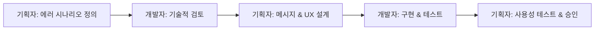

# 계층적 에러 처리 가이드라인

## 개요
이 프로젝트는 **3계층 통일 에러 코드 시스템**을 사용합니다. 모든 에러가 `domain.action.reason` 구조로 통일되어 일관성을 보장하고, 그룹화와 관리 용이성을 극대화하며, 타입 안전성이 보장되는 표준화된 에러 처리를 제공합니다.

### **3계층 통일의 장점:**
- ✅ **일관성**: 모든 에러가 동일한 패턴
- ✅ **예측 가능성**: 개발자가 구조를 외우지 않아도 됨
- ✅ **클라이언트 처리 단순화**: 항상 3개 요소로 분리 가능

## 🎯 **에러 정의 책임 분담**

### **기획자 주도 영역:**
- 에러 시나리오 식별 및 우선순위 설정
- 사용자 메시지 작성 (한국어/영어)
- 에러 발생 시 사용자 액션 정의 (버튼, 모달, 리다이렉트)
- A/B 테스트 및 메시지 개선 방향 결정

### **개발자 담당 영역:**
- 에러 코드 명명 (`meeting.publish.isDraft`)
- Context 타입 정의 및 기술적 구현
- HTTP 상태 코드 및 로그 레벨 결정
- 성능 및 보안 고려사항 검토

### **협업 워크플로우:**


## 핵심 원칙

### 1. 3계층 에러 코드 (domain.action.reason)
```typescript
// ❌ Bad - 단일 계층의 에러 코드
throw new AppException('MEETING_CANNOT_PUBLISH_DRAFT');

// ✅ Good - 3계층 통일된 구조로 일관성 보장
throw new AppError('meeting.publish.isDraft');
```

### 2. 그룹화 용이성
```typescript
// 발행 관련 모든 에러 검색 가능
const publishErrors = errors.filter(e => e.code.startsWith('meeting.publish.'));

// 미팅 도메인 전체 에러 검색 가능  
const meetingErrors = errors.filter(e => e.code.startsWith('meeting.'));
```

### 3. 타입 안전한 Context
모든 계층적 에러 코드는 `HierarchicalErrorContextMap`에 정의된 타입에 따라 context를 받습니다:

```typescript
// HierarchicalErrorContextMap 정의
export type HierarchicalErrorContextMap = {
  'meeting.publish.isDraft': {
    currentStatus: string;
    requiredStatus: string;
  };
  'resource.fetch.notFound': {     // 3계층 통일
    resourceType: string;
  };
  'auth.validate.failed': undefined;  // 3계층 통일
  // ...
};
```

### 4. Context 표준화 원칙
Context에는 **오직 i18n 템플릿 변수만** 포함되어야 합니다:

```typescript
// ❌ Bad - 불필요한 정보 포함
throw new AppError('resource.fetch.notFound', {
  resourceType: 'meeting',
  resourceId: meetingId,  // 템플릿에 사용되지 않는 ID
  message: '리소스를 찾을 수 없습니다'  // 서버측 메시지
});

// ✅ Good - 템플릿 변수만 포함
throw new AppError('resource.fetch.notFound', {
  resourceType: 'meeting'  // i18n 템플릿: "{{resourceType}}을(를) 찾을 수 없습니다"
});
```

### 5. 3계층 통일 구조

모든 에러는 **3계층(domain.action.reason)**으로 통일되었습니다:

```typescript
// 인증 도메인
'auth.validate.failed'      // 인증 검증 실패 (기존 auth.unauthorized)
'auth.validate.expired'     // 토큰 검증 만료
'auth.authorize.denied'     // 권한 승인 거부 (기존 auth.forbidden)

// 리소스 도메인
'resource.fetch.notFound'   // 리소스 조회 실패 (기존 resource.notFound)
'resource.fetch.duplicate'  // 리소스 중복 발견
'resource.access.denied'    // 리소스 접근 거부

// 검증 도메인
'validation.check.failed'   // 검증 체크 실패 (기존 validation.failed)
'validation.input.invalid'  // 입력값 유효성 오류
'validation.param.invalid'  // 매개변수 유효성 오류
```

## 계층적 에러 코드 카테고리

### 인증/권한 도메인 (auth.*.*) - 3계층 통일
**검증 관련 (auth.validate.*)**
- `auth.validate.failed` - 인증 검증 실패
- `auth.validate.expired` - 토큰 검증 만료

**승인 관련 (auth.authorize.*)**
- `auth.authorize.denied` - 권한 승인 거부

### 미팅 도메인 (meeting.*.*)
**발행 관련 (meeting.publish.*)**
- `meeting.publish.isDraft` - 초안 상태로 발행 불가
- `meeting.publish.alreadyPublished` - 이미 발행된 미팅

**삭제 관련 (meeting.delete.*)**
- `meeting.delete.inProgress` - 진행 중 상태로 삭제 불가

**권한 관련 (meeting.permission.*)**
- `meeting.permission.ownerRequired` - 소유자 권한 필요

### 워크스페이스 도메인 (workspace.*.*)
**접근 관련 (workspace.access.*)**
- `workspace.access.memberRequired` - 멤버 권한 필요
- `workspace.access.denied` - 접근 거부

**멤버 관련 (workspace.member.*)**
- `workspace.member.limitExceeded` - 멤버 수 제한 초과

### 리소스 도메인 (resource.*.*) - 3계층 통일
**조회 관련 (resource.fetch.*)**
- `resource.fetch.notFound` - 리소스 조회 실패
- `resource.fetch.duplicate` - 리소스 중복 발견

**접근 관련 (resource.access.*)**
- `resource.access.denied` - 리소스 접근 거부

### 검증 도메인 (validation.*.*) - 3계층 통일
**체크 관련 (validation.check.*)**
- `validation.check.failed` - 검증 체크 실패

**입력 관련 (validation.input.*)**
- `validation.input.invalid` - 잘못된 입력값

**매개변수 관련 (validation.param.*)**
- `validation.param.invalid` - 잘못된 매개변수

### 스토리지 도메인 (storage.*.*)
**업로드 관련 (storage.upload.*)**
- `storage.upload.failed` - 파일 업로드 실패

**파일 관련 (storage.file.*)**
- `storage.file.notFound` - 파일을 찾을 수 없음

**기타 스토리지 작업**
- `storage.delete.failed` - 파일 삭제 실패
- `storage.presignedUrl.failed` - 사전 서명 URL 생성 실패

### 시스템 도메인 (system.*.*, external.*.*)
- `system.internal.error` - 내부 서버 오류
- `system.service.unavailable` - 서비스 사용 불가
- `external.api.error` - 외부 API 호출 실패

## 사용 예시

### 1. Context가 없는 에러
```typescript
// 인증 실패 (3계층 통일)
if (!user) {
  throw new AppError('auth.validate.failed');
}

// 권한 없음 (3계층 통일)
if (!hasPermission) {
  throw new AppError('auth.authorize.denied');
}
```

### 2. Context가 있는 에러
```typescript
// 리소스를 찾을 수 없음 (3계층 통일)
const workspace = await this.workspaceService.findById(id);
if (!workspace) {
  throw new AppError('resource.fetch.notFound', {
    resourceType: 'workspace'
  });
}

// 미팅 발행 불가
if (meeting.status !== MeetingStatus.COMPLETED) {
  throw new AppError('meeting.publish.isDraft', {
    currentStatus: meeting.status,
    requiredStatus: 'COMPLETED'
  });
}
```

### 3. 그룹별 에러 처리
```typescript
// 특정 그룹의 에러 확인
if (error.isInGroup('meeting.publish.')) {
  // 모든 미팅 발행 관련 에러 처리
  handleMeetingPublishError(error);
}

// 도메인별 에러 확인
if (error.isMeetingError()) {
  // 모든 미팅 관련 에러 처리
  handleMeetingError(error);
}
```

### 4. 새로운 계층적 에러 코드 추가하기

1. `hierarchical-error-code.const.ts`에 에러 코드 추가:
```typescript
export type HierarchicalErrorCode = 
  | 'meeting.publish.isDraft'
  | 'your.new.errorCode'  // 추가 (domain.action.reason 형식)
  // ...
```

2. `hierarchical-error-context.types.ts`에 Context 타입 정의:
```typescript
export type HierarchicalErrorContextMap = {
  // ...
  'your.new.errorCode': {
    templateVar1: string;
    templateVar2: number;
  };
  // ...
};
```

3. `HIERARCHICAL_ERROR_DEFINITIONS`에 HTTP 상태와 로그 레벨 정의:
```typescript
export const HIERARCHICAL_ERROR_DEFINITIONS = {
  // ...
  'your.new.errorCode': { httpStatus: 400, logLevel: 'warn' },
  // ...
};
```

4. 사용:
```typescript
throw new AppError('your.new.errorCode', {
  templateVar1: 'value1',
  templateVar2: 123
});
```

## 클라이언트 에러 처리

클라이언트는 계층적 에러 코드를 받아 적절한 메시지를 표시합니다:

```typescript
// API 응답
{
  "error": {
    "code": "meeting.publish.isDraft",
    "context": {
      "currentStatus": "DRAFT",
      "requiredStatus": "COMPLETED"
    }
  },
  "statusCode": 400,
  "timestamp": "2024-01-01T00:00:00.000Z"
}

// 클라이언트 i18n 처리
const errorMessage = t(`errors.${error.code}`, error.context);
// 결과: "미팅이 DRAFT 상태입니다. COMPLETED 상태여야 발행할 수 있습니다."

// 그룹별 처리도 가능
if (error.code.startsWith('meeting.publish.')) {
  showMeetingPublishGuide();
} else if (error.code.startsWith('storage.upload.')) {
  showFileUploadHelp();
}
```

## 계층적 구조의 장점

### 1. **그룹화 용이성**
```typescript
// 발행 관련 모든 에러를 쉽게 찾기
const publishErrors = logs.filter(log => 
  log.errorCode.startsWith('meeting.publish.')
);

// 워크스페이스 접근 관련 에러들
const accessErrors = logs.filter(log => 
  log.errorCode.startsWith('workspace.access.')
);
```

### 2. **확장성**
```typescript
// 새로운 액션 추가가 쉬움
'meeting.edit.permissionDenied'    // 편집 관련 추가
'meeting.edit.contentTooLarge'     // 편집 관련 추가
'meeting.share.linkExpired'        // 공유 관련 추가
```

### 3. **가독성**
```typescript
// 에러 코드만 봐도 무엇이 잘못되었는지 명확
'meeting.publish.isDraft'          // 미팅 발행 - 초안 상태 문제
'workspace.member.limitExceeded'   // 워크스페이스 멤버 - 한도 초과
'storage.upload.failed'            // 스토리지 업로드 실패
```

## 주의사항

1. **절대 하지 말아야 할 것:**
   - Context에 사용자 메시지 포함하지 않기
   - 템플릿에 사용되지 않는 데이터 추가하지 않기  
   - 2계층 구조 사용하지 않기 (모든 에러는 3계층)

2. **항상 해야 할 것:**
   - **3계층(domain.action.reason) 구조 준수**
   - 논리적 그룹화를 고려한 네이밍
   - Context는 i18n 템플릿 변수만 포함
   - 타입 안전성 유지 (HierarchicalErrorContextMap 사용)

## 마이그레이션 가이드

### **2계층 → 3계층 변환 매핑**

| 기존 (2계층) | 새로운 (3계층 통일) | 의미 |
|-------------|-------------------|------|
| `auth.unauthorized` | `auth.validate.failed` | 인증 검증 실패 |
| `auth.forbidden` | `auth.authorize.denied` | 권한 승인 거부 |
| `auth.token.expired` | `auth.validate.expired` | 토큰 검증 만료 |
| `resource.notFound` | `resource.fetch.notFound` | 리소스 조회 실패 |
| `resource.duplicate` | `resource.fetch.duplicate` | 리소스 중복 발견 |
| `validation.failed` | `validation.check.failed` | 검증 체크 실패 |

### **단일 계층 → 3계층 마이그레이션**

```typescript
// Before - 단일 계층
throw new AppException('MEETING_CANNOT_PUBLISH_DRAFT', {
  currentStatus: meeting.status,
  requiredStatus: 'COMPLETED'
});

// After - 3계층 통일 (일관성 있고 예측 가능!)
throw new AppError('meeting.publish.isDraft', {
  currentStatus: meeting.status,
  requiredStatus: 'COMPLETED'
});
```

## 📚 **관련 문서**

- **계층 구조 선택 기준**: `HIERARCHICAL_ERROR_STRUCTURE_GUIDE.md` 
- **클라이언트 처리 가이드**: `CLIENT_ERROR_HANDLING_GUIDE.md`
- **메시지 관리 템플릿**: `MESSAGE_MANAGEMENT_TEMPLATE.md`
- **에러 코드 정의**: `src/shared/const/hierarchical-error-code.const.ts`
- **Context 타입 정의**: `src/shared/types/hierarchical-error-context.types.ts`
- **AppError 클래스**: `src/shared/exception/app.error.ts`

## 🔄 **실제 워크플로우 예시**

### **새로운 에러 추가 시:**
1. **기획자**: "사용자가 완료되지 않은 미팅을 발행하려고 할 때 어떻게 안내할까?"
2. **개발자**: "이건 `meeting.publish.isDraft`로 정의하고, currentStatus와 requiredStatus를 컨텍스트로 전달하겠습니다"
3. **기획자**: "메시지는 '{{currentStatus}} 상태의 미팅은 발행할 수 없습니다. {{requiredStatus}} 상태가 되어야 합니다'로 하고, [미팅 완료하기] 버튼을 보여주세요"
4. **개발자**: 구현 및 테스트
5. **기획자**: 사용성 테스트 후 승인

### **메시지 개선 시:**
1. **데이터 분석**: `meeting.publish.isDraft` 에러 발생 시 87% 사용자가 미팅을 완료함
2. **기획자**: 전환율이 좋으니 현재 메시지 유지, 버튼 텍스트만 더 명확하게 변경
3. **A/B 테스트**: "미팅 완료하기" vs "작성 완료 후 발행하기"
4. **결과 분석 후 최종 적용**

이렇게 **기획자가 사용자 경험을 주도하고, 개발자가 기술적 구현을 담당하는 분업**으로 효율적인 에러 처리 시스템을 운영할 수 있습니다.