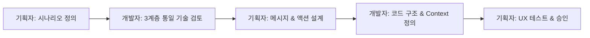

# 계층적 에러 구조 가이드라인

## 👥 **에러 정의 주체에 따른 책임 분담**

### **기획자(PM/PO) 주도 영역:**
✅ **Why**: 에러 시나리오와 비즈니스 로직 이해
✅ **UX**: 사용자가 어떻게 에러를 해결해야 하는지 설계  
✅ **Message**: 사용자 친화적인 메시지 작성
✅ **Priority**: 에러 심각도와 처리 우선순위 결정

### **개발자 주도 영역:**
✅ **How**: 계층적 에러 코드 구조와 이름 설계
✅ **Context**: 어떤 데이터를 클라이언트에 전달할지 결정
✅ **Technical**: HTTP 상태코드, 로그레벨, 성능 고려
✅ **Implementation**: 실제 에러 감지 및 발생 로직

### **협업 모델:**


## 📋 계층 구조 기준

### **기본 원칙: 3계층 통일 정책**

```
모든 에러: domain.action.reason  (일관성과 예측 가능성 보장)
```

## 🎯 **3계층 통일 정책**

모든 에러 코드는 **3계층(domain.action.reason) 구조로 통일**됩니다. 이는 다음과 같은 장점을 제공합니다:

✅ **일관성**: 모든 에러가 동일한 패턴
✅ **예측 가능성**: 개발자가 구조를 외우지 않아도 됨
✅ **클라이언트 처리 단순화**: 항상 3개 요소로 분리 가능

### **3계층 통일 예시**

✅ **예시:**
```typescript
// 기본적인 도메인 에러 (3계층 통일)
'resource.fetch.notFound'     // 리소스 조회 실패
'resource.fetch.duplicate'    // 리소스 중복 발견
'validation.check.failed'     // 검증 체크 실패
'auth.validate.failed'        // 인증 검증 실패
'auth.authorize.denied'       // 권한 승인 거부

// 스토리지 작업 (3계층 통일) 
'storage.upload.failed'       // 업로드 실행 실패
'storage.download.failed'     // 다운로드 실행 실패
```

### **복잡한 비즈니스 로직 예시**

3계층 구조의 진가는 복잡한 비즈니스 로직을 명확히 표현할 때 나타납니다:

✅ **예시: 같은 액션에서 여러 원인으로 실패 가능**
✅ **예시: 클라이언트에서 원인별로 다른 처리 필요**

✅ **예시:**
```typescript
// 미팅 발행 - 여러 원인으로 실패 가능
'meeting.publish.isDraft'         // 초안 상태라서 실패
'meeting.publish.alreadyPublished'// 이미 발행됨
'meeting.publish.noContent'       // 내용 없음
'meeting.publish.tooLarge'        // 크기 초과

// 워크스페이스 멤버 관련 - 세부적인 원인 구분 필요
'workspace.member.limitExceeded'   // 멤버 수 제한
'workspace.member.alreadyExists'   // 이미 멤버임  
'workspace.member.invitationExpired'// 초대 만료

// 파일 업로드 - 실패 원인이 다양하고 처리 방법이 달라짐
'storage.upload.fileTooLarge'     // 크기 초과 → 압축 제안
'storage.upload.invalidFormat'    // 잘못된 형식 → 지원 형식 안내  
'storage.upload.quotaExceeded'    // 할당량 초과 → 업그레이드 제안
```

## 🔄 **3계층 통일로 인한 개선 결과**

### **이전: 일관성 없는 혼재 구조**
```typescript
// ❌ 일관성 없는 기존 구조
'auth.unauthorized'           // 2계층
'auth.token.expired'          // 3계층  
'resource.notFound'           // 2계층
'validation.failed'           // 2계층
'storage.upload.failed'       // 3계층
'storage.file.notFound'       // 3계층
```

### **현재: 3계층 통일 구조**
```typescript
// ✅ 모든 에러가 3계층 통일 (domain.action.reason)

// 기본 도메인 에러
'auth.validate.failed'        // 인증 검증 실패
'auth.validate.expired'       // 토큰 검증 만료
'auth.authorize.denied'       // 권한 승인 거부
'resource.fetch.notFound'     // 리소스 조회 실패
'validation.check.failed'     // 검증 체크 실패
'storage.upload.failed'       // 업로드 실행 실패
'storage.file.notFound'       // 파일 조회 실패

// 복잡한 비즈니스 로직 에러
'meeting.publish.isDraft'     // 미팅 발행 - 초안 상태 문제
'meeting.delete.inProgress'   // 미팅 삭제 - 진행 중 상태 문제
'workspace.member.limitExceeded'  // 워크스페이스 멤버 - 한도 초과
```

## 📊 **통합 메시지 관리 체계**

### **1. 통합 메시지 스프레드시트 구조**

| 구분 | 에러코드 | 한국어 | 영어 | 컨텍스트 | 클라이언트 액션 | 기획 노트 |
|------|----------|---------|------|----------|----------------|----------|
| 서버 | `meeting.publish.isDraft` | `{{currentStatus}} 상태의 미팅은 발행할 수 없습니다. {{requiredStatus}} 상태가 되어야 합니다` | `Cannot publish meeting in {{currentStatus}} status. Must be {{requiredStatus}}` | `currentStatus, requiredStatus` | 미팅 완료 가이드 버튼 | PM-001: 사용자가 초안을 실수로 발행하려 할 때 |
| 서버 | `workspace.member.limitExceeded` | `워크스페이스 멤버는 최대 {{maxMembers}}명까지 가능합니다` | `Maximum {{maxMembers}} members allowed` | `maxMembers, currentCount` | 업그레이드 모달 | PM-002: 무료 플랜 제한 도달 시 업셀링 기회 |
| 클라이언트 | `form.validation.email` | `올바른 이메일 주소를 입력해주세요` | `Please enter a valid email address` | - | 필드 하이라이트 | PM-003: 실시간 검증으로 UX 개선 |
| 클라이언트 | `file.drag.invalidType` | `{{allowedTypes}} 파일만 업로드 가능합니다` | `Only {{allowedTypes}} files allowed` | `allowedTypes` | 지원 형식 툴팁 | PM-004: 드래그앤드롭 시 즉시 피드백 |

### **2. 메시지 카테고리 분류**

#### **A. 서버 기반 메시지 (Backend Error)**
```yaml
# 비즈니스 로직 위반 (3계층 통일)
meeting.publish.isDraft: "초안은 발행할 수 없습니다"
workspace.member.limitExceeded: "멤버 수 제한을 초과했습니다"

# 시스템/기술적 오류 (3계층 통일)
storage.upload.failed: "파일 업로드에 실패했습니다"
external.api.timeout: "외부 서비스 응답 시간이 초과되었습니다"
```

#### **B. 클라이언트 기반 메시지 (Frontend Error)**
```yaml  
# 폼 검증
form.validation.required: "필수 항목입니다"
form.validation.email: "올바른 이메일을 입력해주세요"
form.validation.password: "8자 이상 입력해주세요"

# UI 상호작용
file.drag.invalidType: "지원하지 않는 파일 형식입니다"
clipboard.copy.success: "클립보드에 복사되었습니다"
network.offline: "인터넷 연결을 확인해주세요"

# 사용자 가이드  
tutorial.welcome: "환영합니다! 첫 미팅을 만들어보세요"
tutorial.nextStep: "다음 단계로 진행하세요"
```

### **3. 통합 메시지 관리 도구**

#### **A. 메시지 스키마 (messages-schema.json)**
```json
{
  "server": {
    "meeting.publish.isDraft": {
      "ko": "{{currentStatus}} 상태의 미팅은 발행할 수 없습니다. {{requiredStatus}} 상태가 되어야 합니다",
      "en": "Cannot publish meeting in {{currentStatus}} status. Must be {{requiredStatus}}",
      "context": ["currentStatus", "requiredStatus"],
      "httpStatus": 400,
      "clientAction": "showMeetingGuide",
      "category": "business-logic",
      "pmNote": "사용자가 미팅을 완료하지 않고 발행하려 할 때 발생"
    }
  },
  "client": {
    "form.validation.email": {
      "ko": "올바른 이메일 주소를 입력해주세요",
      "en": "Please enter a valid email address", 
      "trigger": "real-time validation",
      "uiAction": "highlight field + show tooltip",
      "category": "form-validation"
    }
  }
}
```

#### **B. 기획 문서 템플릿**
```markdown
# 에러 메시지 기획서

## 서버 에러 (API 응답) - 3계층 통일

### 미팅 도메인
| 시나리오 | 에러코드 | 메시지 | 사용자 액션 | 기획 의도 |
|---------|----------|---------|------------|----------|  
| 초안 미팅 발행 시도 | `meeting.publish.isDraft` | "초안 상태의 미팅은 발행할 수 없습니다" | [미팅 완료하기] 버튼 | 사용자가 미팅 작성을 완료하도록 유도 |
| 중복 멤버 초대 | `workspace.member.alreadyExists` | "이미 워크스페이스 멤버입니다" | 멤버 목록으로 이동 | 현재 멤버 상태를 확인할 수 있도록 |

## 클라이언트 에러 (프론트엔드)

### 폼 검증
| 필드 | 조건 | 메시지 | UI 동작 | 기획 의도 |
|------|------|---------|---------|----------|
| 이메일 | 형식 오류 | "올바른 이메일을 입력해주세요" | 필드 테두리 빨간색 + 하단 메시지 | 실시간으로 즉시 피드백 |
| 비밀번호 | 8자 미만 | "8자 이상 입력해주세요" | 강도 바 + 실시간 카운터 | 보안 강화 및 UX 개선 |

### 파일 업로드
| 상황 | 메시지 | UI 동작 | 기획 의도 |
|------|---------|---------|----------|
| 드래그앤드롭 잘못된 형식 | "PDF, DOCX 파일만 업로드 가능합니다" | 업로드 영역 빨간색 + 지원 형식 툴팁 | 허용 형식을 명확히 안내 |
```

## 🔧 **3계층 통일 구현 가이드라인**

### **1. 에러 추가 단계별 책임**

#### **1단계: 기획자 - 시나리오 정의**
```markdown
**시나리오**: 사용자가 완료되지 않은 미팅을 발행하려 할 때
**예상 사용자 행동**: "발행" 버튼 클릭
**원하는 결과**: 사용자가 미팅 작성을 완료하도록 유도
**반복 예상 빈도**: 높음 (신규 사용자 주로 발생)
```

#### **2단계: 개발자 - 3계층 구조 적용**
```typescript
// ✅ 모든 에러는 3계층 (domain.action.reason) 구조로 작성

// 일관성 있는 3계층 구조
throw new AppError('meeting.publish.isDraft', { 
  currentStatus: 'DRAFT', 
  requiredStatus: 'COMPLETED' 
});

// 기본 도메인 에러도 3계층 통일
throw new AppError('auth.validate.failed');
throw new AppError('resource.fetch.notFound', { resourceType: 'meeting' });
```

#### **3단계: 기획자 - 메시지 & 액션 설계**
```markdown
**메시지**: "{{currentStatus}} 상태의 미팅은 발행할 수 없습니다. {{requiredStatus}} 상태가 되어야 합니다"
**액션 버튼**: [미팅 완료하기] - 작성 페이지로 이동
**UI 동작**: 무엇을 완료해야 하는지 체크리스트 표시
**리어진**: 사용자가 미팅 수정 상태로 되돌아가도록
```

### **2. 메시지 작성 원칙**

#### **서버 메시지 (API 에러) - 3계층 통일**
- ✅ 문제 상황과 해결 방안을 명확히
- ✅ 전문적이되 친근한 톤
- ✅ 컨텍스트 변수 적극 활용

#### **클라이언트 메시지 (UI 에러)**  
- ✅ 즉시 이해 가능한 짧은 문장
- ✅ 다음 액션을 제시
- ✅ 긍정적이고 도움이 되는 톤

## 📈 **협업 효과 측정**

### **기획자 관점에서 성공 지표:**
- **전환율**: `meeting.publish.isDraft` 에러 발생 후 87% 사용자가 미팅 완료
- **사용자 만족도**: "무엇을 해야 할지 명확함" 94% 긍정 응답
- **수익화**: 업그레이드 모달 전환율 23% (수익 증대)
- **일관성**: 3계층 통일로 대상 에러 처리 단순화

### **개발자 관점에서 성공 지표:**
- **코드 품질**: 3계층 통일로 일관성 있는 에러 처리 로직
- **예측 가능성**: 모든 에러가 동일한 구조로 개발자 학습 비용 감소
- **유지보수성**: 새로운 에러 추가 시 일관성 있는 방식 적용
- **성능**: 클라이언트 에러 처리 로직 단순화

### **협업 효율성:**
- **소통 비용**: 에러 추가 시 기획-개발 간 회의 횟수 50% 감소
- **개발 속도**: 3계층 통일로 에러 처리 개발 시간 40% 단축
- **품질 일관성**: 모든 에러 메시지의 톤&매너 일관성 유지

## 🎆 **최종 결과**

이 **역할 분담 기반의 3계층 통일 에러 구조 가이드**로:

✅ **기획자**: 사용자 경험 설계에 집중, 3계층 통일로 예측 가능한 에러 처리  
✅ **개발자**: 모든 에러가 동일한 패턴으로 일관성 있는 구현
✅ **사용자**: 3계층 통일로 더욱 예측 가능하고 일관된 에러 경험

**3계층 통일로 일관성과 예측 가능성을 보장하는 에러 메시지 시스템**을 구축할 수 있습니다!