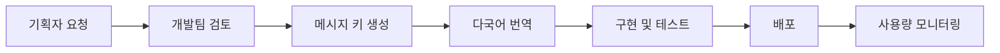
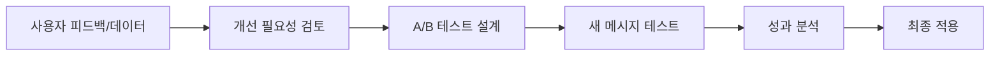

# 통합 메시지 관리 시트 템플릿

## 📊 **스프레드시트 구조 (Google Sheets/Excel)**

### **시트 1: 서버 에러 메시지 (API Errors)**

| ID | 도메인 | 에러코드 | 계층 | 한국어 메시지 | 영어 메시지 | 컨텍스트 변수 | HTTP 상태 | 클라이언트 액션 | 기획 노트 | 개발 상태 |
|----|--------|----------|------|--------------|-------------|--------------|-----------|----------------|----------|----------|
| E001 | 인증 | `auth.validate.failed` | 3 | 로그인이 필요합니다 | Login required | - | 401 | 로그인 페이지로 리다이렉트 | 인증 검증 실패 (토큰 만료 또는 미로그인) | ✅ 완료 |
| E002 | 미팅 | `meeting.publish.isDraft` | 3 | {{currentStatus}} 상태의 미팅은 발행할 수 없습니다. {{requiredStatus}} 상태가 되어야 합니다 | Cannot publish meeting in {{currentStatus}} status. Must be {{requiredStatus}} | currentStatus, requiredStatus | 400 | [미팅 완료하기] 버튼 표시 | 사용자가 미팅 작성을 완료하도록 유도하는 핵심 UX | 🚧 개발 중 |
| E003 | 미팅 | `meeting.participant.limitExceeded` | 3 | 참여자는 최대 {{maxParticipants}}명까지 가능합니다 | Maximum {{maxParticipants}} participants allowed | maxParticipants, currentCount | 400 | [요금제 업그레이드] 모달 | 무료 플랜 제한 → 유료 전환 기회 | 📋 계획됨 |
| E004 | 워크스페이스 | `workspace.member.limitExceeded` | 3 | 워크스페이스 멤버는 최대 {{maxMembers}}명까지 가능합니다 | Maximum {{maxMembers}} members allowed | maxMembers, currentCount | 429 | [워크스페이스 업그레이드] CTA | 팀 확장 시점의 업셀링 전략 | 📋 계획됨 |
| E005 | 리소스 | `resource.fetch.notFound` | 3 | {{resourceType}}을(를) 찾을 수 없습니다 | {{resourceType}} not found | resourceType | 404 | 홈으로 돌아가기 또는 새로고침 | 리소스 조회 실패 (404 상황) | ✅ 완료 |
| E006 | 스토리지 | `storage.upload.failed` | 3 | 파일 업로드에 실패했습니다 | File upload failed | - | 502 | [다시 시도] 버튼 + 네트워크 상태 확인 안내 | 스토리지 업로드 실행 실패 | ✅ 완료 |

### **시트 2: 클라이언트 메시지 (Frontend Messages)**

| ID | 카테고리 | 메시지 키 | 한국어 메시지 | 영어 메시지 | 컨텍스트 | 트리거 상황 | UI 동작 | 기획 의도 | 개발 상태 |
|----|----------|-----------|--------------|-------------|----------|------------|---------|----------|----------|
| C001 | 폼 검증 | `form.validation.email` | 올바른 이메일 주소를 입력해주세요 | Please enter a valid email address | - | 이메일 형식 오류 | 필드 테두리 빨간색 + 하단 에러 메시지 | 실시간 검증으로 사용자 경험 개선 | ✅ 완료 |
| C002 | 폼 검증 | `form.validation.required` | 필수 입력 항목입니다 | This field is required | fieldName | 필수 필드 비어있음 | 필드 shake 애니메이션 + 포커스 | 직관적인 필수 항목 안내 | ✅ 완료 |
| C003 | 폼 검증 | `form.validation.password.weak` | 8자 이상, 영문/숫자/특수문자를 포함해주세요 | Password must be 8+ chars with letters, numbers, symbols | minLength, requirements | 비밀번호 강도 부족 | 실시간 강도 바 + 요구사항 체크리스트 | 보안 강화를 위한 UX 가이드 | 🚧 개발 중 |
| C004 | 파일 업로드 | `file.drag.invalidType` | {{allowedTypes}} 파일만 업로드 가능합니다 | Only {{allowedTypes}} files are allowed | allowedTypes | 지원하지 않는 파일 드래그 | 업로드 영역 빨간색 경계 + 툴팁 | 지원 형식을 명확히 안내 | 📋 계획됨 |
| C005 | 파일 업로드 | `file.size.tooLarge` | 파일 크기는 {{maxSize}}MB 이하여야 합니다 | File size must be under {{maxSize}}MB | maxSize, currentSize | 파일 크기 초과 | 진행률 바 중단 + 압축 옵션 제안 | 대용량 파일 처리 방안 제시 | 📋 계획됨 |
| C006 | 사용자 피드백 | `clipboard.copy.success` | 클립보드에 복사되었습니다 | Copied to clipboard | - | 복사 버튼 클릭 | 간단한 토스트 메시지 (2초) | 액션 완료 확인으로 사용자 신뢰 향상 | ✅ 완료 |
| C007 | 네트워크 | `network.offline` | 인터넷 연결을 확인해주세요 | Please check your internet connection | - | 네트워크 끊어짐 감지 | 상단 배너 + 자동 재연결 시도 | 오프라인 상태 명확한 안내 | 🚧 개발 중 |
| C008 | 튜토리얼 | `tutorial.meeting.create` | 🎉 첫 미팅을 만들어보세요! | 🎉 Create your first meeting! | - | 빈 상태 화면 | 중앙 CTA 버튼 + 단계별 가이드 | 신규 사용자 온보딩 유도 | 📋 계획됨 |

### **시트 3: 다국어 확장 (i18n Extensions)**

| 메시지 키 | 한국어 | 영어 | 일본어 | 중국어(간체) | 우선순위 | 번역 상태 |
|-----------|---------|------|---------|-------------|----------|----------|
| `auth.unauthorized` | 로그인이 필요합니다 | Login required | ログインが必要です | 需要登录 | 높음 | ✅ 완료 |
| `meeting.publish.isDraft` | 초안 상태의 미팅은... | Cannot publish meeting... | 下書き状態のミーティング... | 草稿状态的会议无法... | 높음 | 🚧 진행 중 |

### **시트 4: 메시지 사용 통계 (Analytics)**

| 메시지 키 | 월별 노출 횟수 | 사용자 반응률 | 개선 필요도 | 마지막 업데이트 | 담당 팀 |
|-----------|--------------|-------------|-------------|----------------|----------|
| `meeting.publish.isDraft` | 1,247회 | 87% (미팅 완료 전환) | 낮음 | 2024-08-20 | Product Team |
| `form.validation.email` | 15,692회 | 94% (올바른 이메일 입력) | 낮음 | 2024-07-15 | UX Team |
| `storage.uploadFailed` | 342회 | 45% (재시도 성공) | 높음 ⚠️ | 2024-06-01 | Platform Team |

## 🔄 **메시지 라이프사이클 관리**

### **1. 메시지 추가 프로세스**



### **2. 메시지 수정 프로세스**



## 📋 **기획자용 메시지 작성 가이드**

### **서버 에러 메시지 작성 원칙 (3계층 통일)**
1. **문제 + 해결책** 구조: "~할 수 없습니다. ~해주세요"
2. **컨텍스트 변수 활용**: 구체적 정보 제공
3. **다음 액션 제시**: 사용자가 무엇을 해야 하는지 명확히
4. **전문적이되 친근한 톤**: 기술적이지만 이해하기 쉽게
5. **3계층 일관성**: 모든 에러가 domain.action.reason 형태

**✅ 좋은 예시 (3계층 통일):**
- `meeting.publish.isDraft`: "초안 상태의 미팅은 발행할 수 없습니다. 미팅을 완료해주세요"
- `workspace.member.limitExceeded`: "무료 플랜은 최대 5명까지 가능합니다. 업그레이드하시겠어요?"
- `resource.fetch.notFound`: "요청하신 리소스를 찾을 수 없습니다"
- `auth.validate.failed`: "로그인이 필요합니다"

**❌ 나쁜 예시:**
- "오류가 발생했습니다" (너무 모호함)
- "DRAFT_STATUS_VIOLATION_ERROR" (기술적이고 어려움)

### **클라이언트 메시지 작성 원칙**
1. **즉시 이해 가능**: 3초 안에 파악 가능한 메시지
2. **액션 지향적**: 사용자가 바로 실행할 수 있는 안내
3. **긍정적 톤**: 실수를 지적하기보다는 도움을 주는 방향
4. **일관성 유지**: 비슷한 상황은 비슷한 패턴으로

**✅ 좋은 예시:**
- `form.validation.email`: "올바른 이메일 주소를 입력해주세요" 
- `file.drag.success`: "파일이 업로드되었습니다 ✓"

**❌ 나쁜 예시:**
- "잘못된 입력" (구체적이지 않음)
- "에러: 이메일 형식 오류" (부정적이고 기술적)

## 🛠 **개발팀용 구현 가이드**

### **서버 사이드 (NestJS) - 3계층 통일**
```typescript
// ✅ 권장: 3계층 통일 구조와 명확한 컨텍스트
throw new AppError('meeting.publish.isDraft', {
  currentStatus: meeting.status,
  requiredStatus: MeetingStatus.COMPLETED
});

// 3계층 통일 기본 에러들
throw new AppError('auth.validate.failed');
throw new AppError('resource.fetch.notFound', { resourceType: 'meeting' });
throw new AppError('validation.check.failed', { fields: { email: ['required'] } });

// ❌ 지양: 컨텍스트 없는 범용 메시지 및 2계층 구조
throw new AppError('general.error');          // 범용적임
throw new AppError('auth.unauthorized');      // 2계층 → 3계층으로 바꿔야 함
```

### **클라이언트 사이드 (React) - 3계층 대응**
```typescript
// ✅ 권장: 3계층 통일 에러 코드 대응
const message = t(`errors.${error.code}`, error.context || {});

// 3계층 구조 활용한 그룹별 처리
if (error.code.startsWith('auth.validate.')) {
  redirectToLogin();
} else if (error.code.startsWith('meeting.publish.')) {
  showMeetingGuide();
} else if (error.code.startsWith('resource.fetch.')) {
  showNotFoundPage();
}

// ✅ 권장: 3계층 통일 구조 활용한 에러 처리
if (error.code.startsWith('meeting.publish.')) {
  showMeetingGuide();
} else if (error.code.startsWith('workspace.member.')) {
  showUpgradeModal();
} else if (error.code.startsWith('validation.check.')) {
  highlightInvalidFields(error.context);
}
```

이 **3계층 통일 체계**로 **기획팀과 개발팀이 효율적으로 협업하며 일관성 있고 예측 가능한 사용자 경험**을 만들 수 있습니다!